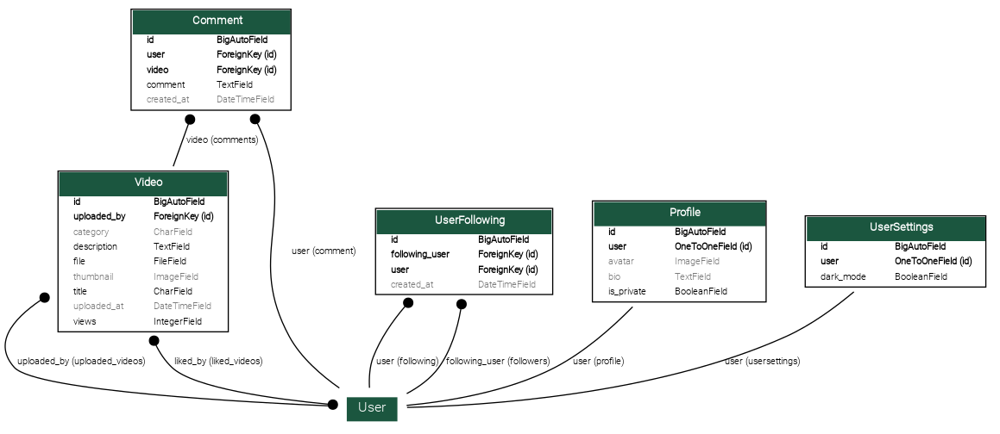

# Database Schema

---

## Relationships

* **User-Video**         : One-to-Many     ( `User.id` -> `Video.uploaded_by` )

* **Video-Tag**          : Many-to-Many    ( `Video.id` <-> `Tag.id` via `VideoTags` )

* **User-Like**          : Many-to-Many    ( `User.id` <-> `Video.id` via `Like` )

* **User-Comment**       : One-to-Many     ( `User.id` -> `Comment.user_id`)

* **Video-Comment**      : One-to-Many     ( `Video.id` -> `Comment.video_id` )

* **User-Follow**        : Many-to-Many    ( `User.id` <-> `User.id` via `UserFollowing` )

* **User-Profile**       : One-to-One      ( `User.id` <-> `Profile.user_id` )

* **User-Settings**      : One-to-One      ( `User.id` <-> `UserSettings.user_id` )

